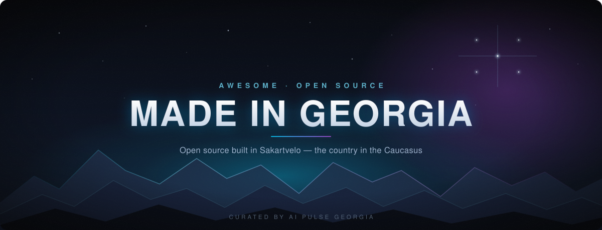

  

<h1 align="center">Awesome Made in Georgia</h1>

  <b>A curated list of open source software built by Georgian developers</b> 
  Maintained by <a href="https://aipulsegeorgia.ge">AI Pulse Georgia</a>

  
  
  
  
  
  

<i>Georgia here means Sakartvelo 🇬🇪 — the country in the Caucasus, not the US state.</i>

---

## About this list

Georgian developers write good open source, but it disappears into GitHub's millions of repositories. There has never been a single place to see what is being built in Sakartvelo. This list is that place.

Unlike most awesome lists, this one is organised by **origin rather than topic**. It does not matter whether a project is about AI, cryptography, or games — what matters is that a Georgian built it.

> **Sister list:** [Awesome AI Pulse Georgia](https://github.com/tornikebolokadze1-cyber/awesome-ai-pulse-georgia) — 300 international AI and developer tools, described in Georgian. The two lists point in opposite directions: that one curates *the best of the world* for a Georgian audience, this one shows *what Georgia builds* to everyone else.

**What counts as Georgian** — the exact criteria and submission rules live in [CONTRIBUTING.md](CONTRIBUTING.md).

---

## Contents

- [🤖 AI Agents & Orchestration](#-ai-agents--orchestration)
- [🏦 Georgian APIs & Integrations](#-georgian-apis--integrations)
- [📦 Libraries & SDKs](#-libraries--sdks)
- [🔤 Georgian Language & NLP](#-georgian-language--nlp)
- [🛠️ Developer Tools](#️-developer-tools)
- [🌐 Web & Applications](#-web--applications)
- [🎮 Games & Graphics](#-games--graphics)

---

## 🤖 AI Agents & Orchestration

> Systems that put AI models to work on real codebases — routing tasks between agents, holding context across a run, and deciding whether the output is good enough to keep.

| Repository | ⭐ | Description |
|---|---|---|
| [kimi-atlas](https://github.com/null0xxx/kimi-atlas) | 13 | A many-agent orchestrator for Kimi Code that ships with 115 vendored official skill packages. Its central claim is that **no LLM ever computes pass/fail** — that decision belongs to a deterministic six-lens verification harness with pure gates. The `atlas` core drives a single change through an explicit `INIT → … → OUTPUT` state machine; `ATLAS-WEAVE` decomposes a larger change into a file-disjoint plan-DAG (work split so that no two agents ever touch the same file), drains it with at most three concurrent agents, and merges through a combined-tree differential gate — degrading byte-identically to a single `atlas` run when the work does not decompose. Carries a live ContextGraph recomputed on every refine pass, and two-phase forward-only rollback confined to an isolated worktree, so your real tree is never touched. Python, MIT. |
| [AIWorkHub](https://github.com/shrec/AIWorkHub) | 2 | A local-first control plane for VS Code that turns each Git repository into an isolated AI engineering workspace. It wires the models already available in your editor — Codex, Claude, DeepSeek, GLM, Copilot — to a repository-scoped task queue, a Source Graph, a session manager, durable AI memory, and a review inbox. No cloud account and no HTTP service are required, and it reuses each CLI's existing login rather than copying credentials anywhere. Two ideas carry the design: agents query the structural Source Graph instead of rescanning the tree, which spends far less context, and a change is accepted only once the evidence passes. Python + VS Code extension, MIT. |
| [loop-config](https://github.com/Parsa-29/loop-config) | 0 | A working setup for AI coding agents that refuses to pick a side: one `AGENTS.md` is the source of truth, and everything else is a bridge to it. Codex, Cursor, Copilot, Windsurf, and Cline read that file natively; Claude Code gets it copied or symlinked to `CLAUDE.md`. What it encodes is an Observe → Decide → Act → Verify → Learn loop, and the repo ships each tool's approval-gate settings alongside it, so the same guardrails follow you between editors instead of being rebuilt from memory on every new project. Python and shell. |

---

## 🏦 Georgian APIs & Integrations

> Georgian banking, payment, and government systems, wrapped so software — increasingly, AI assistants — can actually use them. These integrations exist nowhere else: no foreign vendor is going to document the Revenue Service's SOAP endpoints or TBC's XML billing protocol for you.

| Repository | ⭐ | Description |
|---|---|---|
| [georgian-payments-skills](https://github.com/erekle1/georgian-payments-skills) | 9 | Two banks in one skill pack: TBC Bank (Checkout, TPay, and the XML CHECK/PAY billing protocol) and Bank of Georgia (iPay, the installment calculator SDK, PSD2 Open Banking). Ask for a payment flow in plain language and the matching auth flow, endpoints, error codes, and code samples are pulled into context — instead of you reading bank PDFs at 2am. Installs into Claude Code, Cursor, Windsurf, Copilot, Zed, and 37+ other agents with a single `npx skills add`. Python, MIT. |
| [rs-mcp](https://github.com/Parsa-29/rs-mcp) | 8 | Georgia's Revenue Service (rs.ge) is a SOAP estate that most developers meet only under deadline. This exposes it as 85 callable tools across the WayBill, Invoice (NTOS), and TaxPayer services, building the SOAP envelopes and parsing the XML replies so an agent can look up a taxpayer, issue a waybill, or close an invoice from a plain-language request. Since those operations move real documents, every destructive one is gated behind a human-in-the-loop confirmation, and the CLI asks `[y/N]` before anything irreversible. The same 85 operations ship three ways: as an MCP server, as `rs-cli` subcommands with JSON output, and as a Claude Skill folder. TypeScript. |
| [flitt-payments-skill](https://github.com/Parsa-29/flitt-payments-skill) | 5 | One payment provider, covered to the bottom. Thirteen reference documents walk through SHA1 request signing, hosted checkout in both its redirect and server-to-server forms, direct card payments with the two-step 3DS flow, saved-card charges and tokenisation, subscriptions, captures, reversals, webhook validation with idempotency, and how to read Flitt's response codes. Mention Flitt in a prompt and the right reference is pulled in rather than guessed at. A Python helper generates the signatures; one `git clone` into the skills folder installs it in Claude Code or Cursor. Markdown + Python. |

---

## 📦 Libraries & SDKs

> Packages other developers build on top of: npm, PyPI, crates.io, Maven, and the rest.

| Repository | ⭐ | Description |
|---|---|---|
| [UltrafastSecp256k1](https://github.com/shrec/UltrafastSecp256k1) | 48 | A high-performance engine for secp256k1 — the elliptic curve that signs every Bitcoin and Ethereum transaction — built across an unusually wide surface. CPU, CUDA, Metal, and OpenCL backends; embedded, ARM64, RISC-V, and WebAssembly targets; ECDSA, Schnorr, FROST, MuSig2, and BIP-352; and FFI bindings for C, Python, Node.js, Rust, Go, Swift, Java, Dart, C#, PHP, Ruby, and Kotlin. What distinguishes it from the usual speed claim is its posture toward the reader: the README opens by saying it is not a trust request but a verification package, and backs that with a continuous-audit system, replayable evidence, scoped reviewer documentation, a published list of known limitations, constant-time guarantees, and a Zenodo DOI. C++ with CUDA and Metal, MIT. |
| [kd-screen-guard](https://github.com/KhvichaDev/kd-screen-guard) | 2 | A lock-screen overlay for web applications, written on the assumption that whoever is trying to get past it is hostile. It layers WebAuthn biometrics, PBKDF2 key derivation moved off the main thread into a Web Worker, tamper detection, webcam snapshots of whoever failed the unlock, and a hardware Web Audio siren — with React and Vue adapters and zero runtime dependencies. The kind of capability usually bought as a vendor SDK, published instead as an npm package with a live demo and its test count on the badge. TypeScript, MIT. |
| [notifications-kd](https://github.com/KhvichaDev/notifications-kd) | 1 | A toast notification system that fills the gap between rolling your own `div` and pulling in an entire UI framework: glassmorphism modals, `requestAnimationFrame` transitions, responsive mobile behaviour, and not a single dependency. Ships on npm and over both jsDelivr and unpkg, so a plain HTML page can adopt it with one script tag and no build step. JavaScript, MIT. |
| [kd_youtube_background_audio](https://github.com/KhvichaDev/kd_youtube_background_audio) | 1 | A Flutter package for the specific misery of playing YouTube audio in the background on a phone. It wraps `just_audio` and `youtube_explode_dart` and absorbs what actually breaks in production: muxed stream configurations, Android's Doze power saving, CORS proxying on Flutter Web, and state recovery with position preserved after a stream drops. Native lock-screen and notification-centre controls come wired rather than left as an exercise. Published on pub.dev. Dart, MIT. |

---

## 🔤 Georgian Language & NLP

> Technology for the Georgian language itself: NLP models, fonts, keyboard layouts, transliteration, speech, spell checkers, and datasets.

| Repository | ⭐ | Description |
|---|---|---|
| [ka-to-lat](https://github.com/Parsa-29/ka-to-lat) | 3 | Georgian has its own alphabet, which is lovely until something needs ASCII. This converts in both directions — `georgianToLatin("ლორემ იპსუმ")` gives `"Lorem ipsum"`, and the reverse works too — for the places where that matters: search indexing, URL slugs, sortable identifiers, legacy systems. Published on npm as `ka-to-lat`, and it optionally extends `String.prototype` so `"Gamarjoba!".latinToGeorgian()` works inline. The README is refreshingly honest about its one rough edge: some digraphs in the Latin→Georgian direction need specific casing (`gverDZe`, not `gverdze`) to resolve correctly. TypeScript, MIT. |

---

## 🛠️ Developer Tools

> CLIs, automation, build tooling, DevOps — anything that makes a developer's day shorter.

| Repository | ⭐ | Description |
|---|---|---|
| [awesome-ai-pulse-georgia](https://github.com/tornikebolokadze1-cyber/awesome-ai-pulse-georgia) | 130 | The sister list of this one, and a queryable tool rather than just a page: 300 curated AI agent frameworks, coding agents, and automation resources, every entry described in Georgian rather than copied from its README. It ships an MCP server and an `aipulse` CLI, so you can ask which repo fits a job in natural language from inside Claude Code, Cursor, Codex, or any MCP client — instead of scrolling a 280 KB README. Maintained by the same people who maintain this list. TypeScript, CC0. |
| [npm-trusted-publisher](https://github.com/KhvichaDev/npm-trusted-publisher) | 2 | Removes the `NPM_TOKEN` secret from your release pipeline entirely, replacing it with OIDC so publishing to npm needs no long-lived credential sitting in GitHub Actions at all. A zero-config CLI drops in a workflow that syncs package versions, updates the changelog, commits build artefacts, and attaches npm's official provenance badge to the release. Worth knowing about even if you already publish fine: a token that does not exist cannot leak or expire on you mid-release. Published on npm. JavaScript, MIT. |

---

## 🌐 Web & Applications

> Web apps, sites, frontend and backend projects, mobile applications, and the plugins and themes that extend them.

| Repository | ⭐ | Description |
|---|---|---|
| [KD-Waitlist-Notify](https://github.com/KhvichaDev/KD-Waitlist-Notify) | 4 | A WordPress waitlist and lead-capture plugin, written the way WordPress plugins usually are not: a feature-first directory layout, object-oriented throughout, a separate database layer, and controllers kept apart from the views instead of one thousand-line file. It collects signups ahead of a launch and notifies them in batches over email, Twilio SMS, or a custom HTTP gateway, with E.164 phone normalisation and GDPR handling built in rather than bolted on. PHP, GPL-2.0. |

---

## 🎮 Games & Graphics

> Games, graphics engines, creative coding, and visualisation.

*Empty for now. Yours could be the first one here. [Submit it →](CONTRIBUTING.md)*

---

## About

  

This list is maintained by **[AI Pulse Georgia](https://aipulsegeorgia.ge)** — a community focused on AI agents, automation, and the future of autonomous systems.

> *"Exploring Georgia's AI Future"*

If you build Georgian open source, or you simply want it to be more visible, star the list and pass it on.

## Contributing

Know a good repository built by a Georgian developer? Have one of your own? Open an issue or send a pull request — the full rules and the "what counts as Georgian" criteria are in **[CONTRIBUTING.md](CONTRIBUTING.md)**.

Submitting your own project is encouraged. This is not self-promotion: a list organised by authorship only works if the authors bring their own work to it.

## License

The list is released under [CC0 1.0 Universal](LICENSE). Every repository listed keeps its own license.
